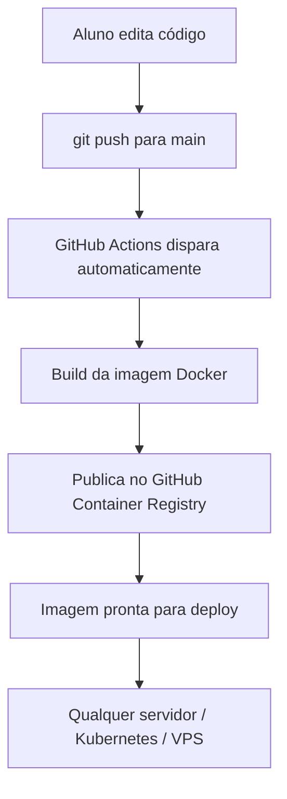

# 🚀 Pipeline Docker para Aula de DevOps / Containerização

> **Material pronto para usar em sala de aula**  
> Nível: Iniciante a Intermediário  
> Duração sugerida: 2 aulas de 2h ou 1 aula prática + lição de casa

---

## 🎯 Objetivo da Aula

Ensinar os alunos a:
- Containerizar uma aplicação web com Docker
- Criar um `Dockerfile` eficiente
- Usar `docker compose` no dia a dia de desenvolvimento
- Automatizar todo o processo com um **pipeline CI/CD** usando GitHub Actions
- Publicar a imagem automaticamente no GitHub Container Registry (GHCR)

No final da aula, cada aluno terá um repositório funcional com pipeline rodando!

---

## 📋 Pré-requisitos (para os alunos)

| Item | Onde conseguir | Obrigatório? |
|------|----------------|--------------|
| Docker Desktop | [docker.com/products/docker-desktop](https://www.docker.com/products/docker-desktop/) | Sim |
| Conta GitHub | github.com | Sim |
| Git instalado | Já vem com Docker Desktop no Windows/Mac | Sim |
| VS Code + extensões Docker | Extensão oficial "Docker" da Microsoft | Recomendado |
| Conta Docker Hub (opcional) | hub.docker.com | Só se quiser usar Docker Hub |

> **Dica para o professor:** Peça para os alunos criarem o repositório no GitHub **antes** da aula prática.

---

## 🏗️ Estrutura do Projeto (o que vamos criar)

```
meu-pipeline-docker/
├── .github/
│   └── workflows/
│       └── docker-pipeline.yml          ← O pipeline CI/CD
├── app.py                               ← Aplicação Flask simples
├── requirements.txt
├── Dockerfile
├── docker-compose.yml
├── .dockerignore
└── README.md
```

---

## 1. Criando a Aplicação de Exemplo (Python + Flask)
Nesta primeira parte vamos criar uma aplicação web bem simples usando **Flask** (um framework leve e muito usado para ensino).

### O que vamos construir?

- Uma página inicial (`/`) que exibe uma mensagem amigável confirmando que a aplicação está rodando dentro de um container Docker.
- Um endpoint de saúde (`/health`) que retorna um JSON. Esse endpoint é muito útil em pipelines e em ambientes de produção para verificar se a aplicação está funcionando corretamente.

### Por que usar Flask?

Flask é excelente para aulas porque:
- Tem sintaxe simples e fácil de entender
- Não exige configuração complexa
- Permite criar uma aplicação funcional com poucas linhas de código
- É amplamente utilizado no mercado

### Arquivos necessários

Vamos precisar de dois arquivos:

- `app.py` → contém o código da aplicação web
- `requirements.txt` → lista as bibliotecas Python que a aplicação precisa (no nosso caso, apenas o Flask)

> **Importante para a aula:** Explique aos alunos que em projetos reais o `requirements.txt` costuma ter várias dependências. O Docker vai usar esse arquivo para instalar tudo dentro do container.

---

## 2. O Dockerfile – Containerizando a Aplicação

O **Dockerfile** é o arquivo que contém as instruções para o Docker construir a imagem da nossa aplicação.

### Conceitos principais que vamos ensinar

| Instrução       | O que faz                                                                 | Por que é importante ensinar? |
|-----------------|---------------------------------------------------------------------------|-------------------------------|
| `FROM`          | Define a imagem base (neste caso Python)                                  | Mostra que toda imagem parte de outra |
| `ENV`           | Define variáveis de ambiente                                              | Boas práticas e configuração |
| `WORKDIR`       | Define o diretório de trabalho dentro do container                        | Organização e clareza |
| `COPY`          | Copia arquivos do projeto para dentro da imagem                           | Entender camadas (layers) |
| `RUN`           | Executa comandos durante o build (ex: instalar dependências)              | Instalar o que a app precisa |
| `EXPOSE`        | Documenta qual porta a aplicação usa                                      | Comunicação entre container e host |
| `USER`          | Define qual usuário vai rodar a aplicação                                 | Segurança (não usar root) |
| `CMD`           | Comando padrão que será executado ao iniciar o container                  | Ponto de entrada da aplicação |

### Ordem das instruções (conceito importante)

Uma das lições mais importantes do Dockerfile é a **ordem das instruções**:

1. Primeiro copiamos o `requirements.txt`
2. Depois instalamos as dependências com `RUN pip install`
3. Só então copiamos o código da aplicação (`app.py`)

**Por quê?**  
Porque o Docker cria camadas (layers). Se o código mudar, mas as dependências não, o Docker reutiliza a camada das dependências já instaladas. Isso deixa o build **muito mais rápido**.

### Boas práticas que vamos reforçar

- Usar imagem `python:3.11-slim` (menor que a versão completa)
- Criar um usuário não-root por segurança
- Usar `ENV` para configurar o Python corretamente
- Manter o Dockerfile limpo e legível

> **Exercício para os alunos:**  
> Depois que o pipeline estiver funcionando, peça para eles trocarem a imagem base para `python:3.11-alpine` e comparar o tamanho final da imagem com `docker images`.

---

## 3. Docker Compose para Desenvolvimento Local

O **Docker Compose** é uma ferramenta que permite definir e rodar aplicações multi-container com um único arquivo YAML.

### Por que usar Docker Compose na aula?

- Permite subir a aplicação com **um único comando**
- Facilita configurar portas, volumes e variáveis de ambiente
- Permite **hot-reload** durante o desenvolvimento (alterar o código e ver a mudança sem rebuildar)
- É o padrão da indústria para desenvolvimento local com Docker

### Conceitos que o Docker Compose nos ajuda a ensinar

- **Serviços**: cada aplicação ou banco de dados vira um "service"
- **Build**: como construir a imagem a partir do Dockerfile
- **Volumes**: compartilhar arquivos entre o computador do aluno e o container (útil para desenvolvimento)
- **Ports**: mapear portas do container para o computador local
- **Environment**: passar variáveis de ambiente para dentro do container

### Quando usar Docker Compose vs Dockerfile sozinho?

| Situação                        | Recomendado          | Motivo |
|--------------------------------|----------------------|--------|
| Desenvolvimento diário          | Docker Compose       | Mais prático e rápido |
| Produção simples                | Docker Compose       | Fácil de versionar |
| Ambientes complexos (vários serviços) | Docker Compose | Organização |
| CI/CD (GitHub Actions)          | Apenas Dockerfile    | Mais leve e controlado |

> **Dica para o professor:**  
> Mostre que no dia a dia de desenvolvimento quase todo mundo usa `docker compose up`, enquanto no pipeline de CI/CD geralmente usamos apenas o `docker build`.

---

### Comandos úteis

```bash
# Subir a aplicação
docker compose up --build

# Subir em background
docker compose up -d --build

# Ver logs
docker compose logs -f

# Parar tudo
docker compose down

# Rebuildar do zero (útil quando muda o Dockerfile)
docker compose down --rmi all && docker compose up --build
```

Acesse: **http://localhost:5000**

---
## .dockerignore (crie esse arquivo!)

```
__pycache__
*.pyc
.git
.gitignore
.env
.venv
*.md
.vscode
.idea
```

## Boas Práticas que vamos reforçar na aula

| Prática | Por que é importante? |
|---------|-----------------------|
| Usar imagens `slim` ou `alpine` | Imagens menores = downloads mais rápidos |
| Copiar dependências antes do código | Aproveita cache do Docker |
| Usuário não-root | Segurança (melhor prática) |
| `.dockerignore` | Evita enviar arquivos desnecessários para o build |
| Tags com `latest` + `sha` | Facilita rollback |
| GitHub Actions + GHCR | Tudo integrado, zero custo extra |

---

## Fluxo Completo que o Aluno vai Aprender


